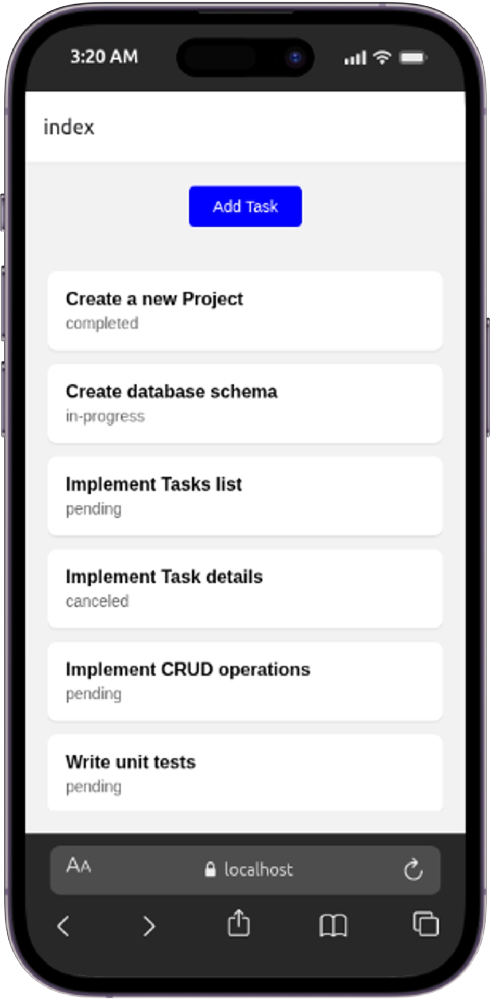
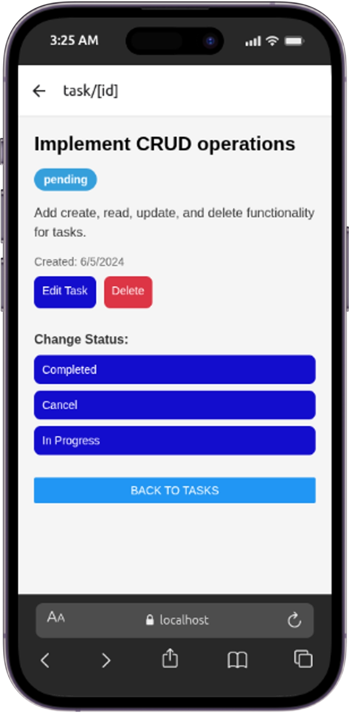
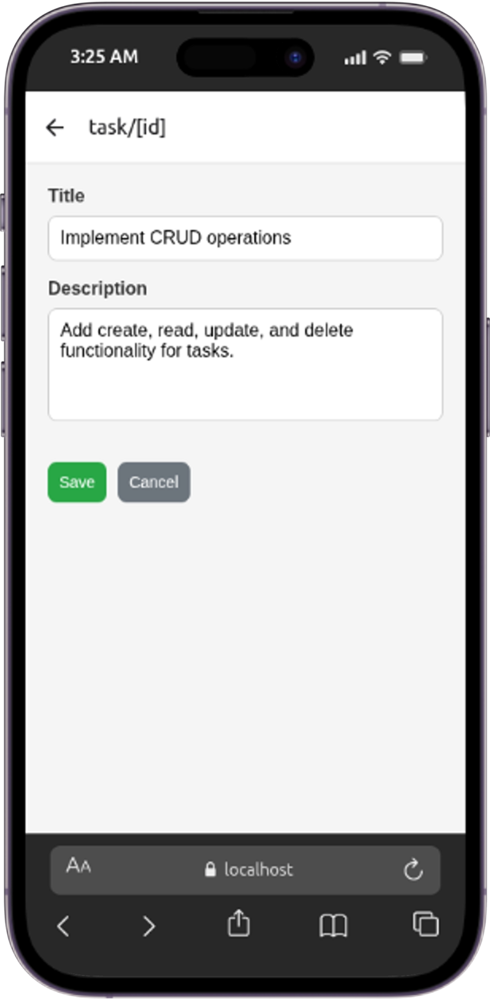
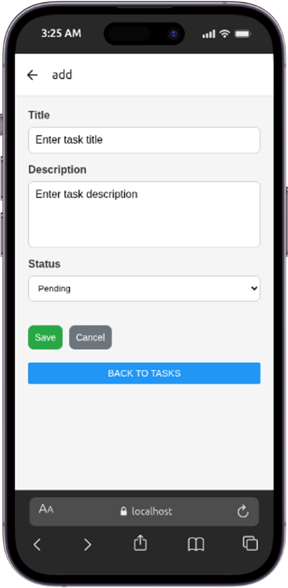

# Tasks manager

## Features

- List tasks
- show task details
- add, delete, and edit tasks

## run the app

- install the dependencies `npm i`
- serve the app `npm start`
- navigate to http://localhost:8081 or scan the QR code via Expo Go to open the app in your mobile.

## technology stack

- React Native
- Expo

## Screenshots

### Tasks List

### task details

### Edit a task

### Add a task

## Demo

<a href="./assets/video-iPhone-14-PRO.webm">view the video</a>

## Known issues

- When deleting the app, a modal pops up for confirmation, as we use the built-in Alert component, it works in native devices only, not in web.
  so, when testing the "delete" functionality, you need to open the app in your mobile phone.
  other functionalities works the same way in web and native devices.
